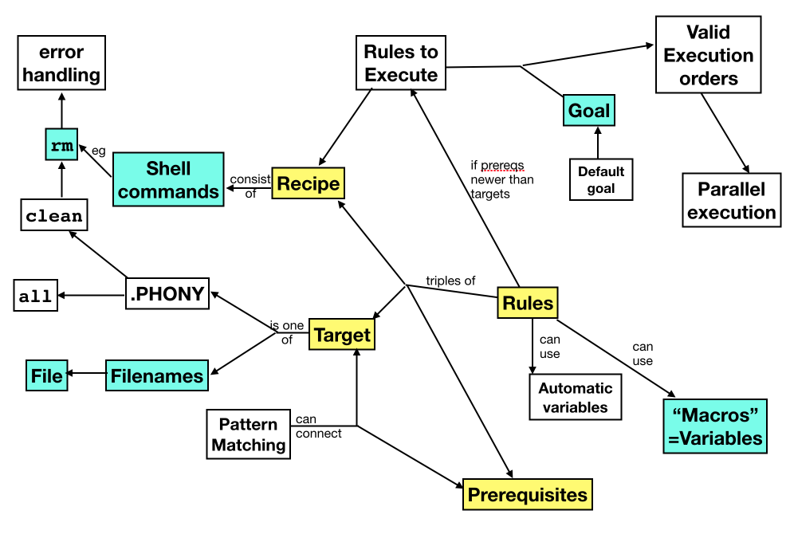

# Make for Reproducible Analysis

Things I'm not sure of:
- POSIX only or GNU?  POSIX only is safest, but if I can assume GNU I'm tempted to go full-GNUism which I'm not sure is wise
- Include debugging or not?
- Planning to only use ":=" for macro assignment, but will this be confusing for students when they inevitably see "=" in places?  
    - Even if it is, is it worth getting into recursively vs simply expanded macros?
- Start with .DEFAULT_GOAL just part of the recipe, or start with empirically "discovering" how the implicit default goal is determined and then adding one explicitly?

## Step 1: Brainstorming

### 1.1 What problem(s) will student learn how to solve?

* How to break a workflow into discrete steps
* Writing reproducible, incrementally-updating data analysis pipelines with Make
* How to make Makefiles more maintainable and less repetitive with macros (variables)
* How to make Makefiles more powerful and less repetitive with pattern rules
* How to speed up pipelines with parallel execution
* How to determine when make is _not_ the right tool for the job
* Debugging with `$(warning)`, `@echo`, `-n`, `-d` (??)

### 1.2 What concepts, skills, & techniques will students learn?

What will be covered:
* Dependencies (code & data)
* Targets, Goals
* Directed Acyclic Graphs (at some level)
* Files as step markets
* Pattern matching
* Automatic / per rule variables
* Dry run
* `touch`
* Parallel execution
* Phony targets
* Default goal
* Delete on error
* .SUFFIXES

What will be left out
* Conditionals ( `$(ifeq  )` and similar )
* Recipe lines starting with - or +
* Order-only prerequisite - in retrospect, adds more complexity than it saves
* User defined functions

Not yet sure about:
* `$(wildcard )`, `$(subst )`, etc - useful enough for the time?
* recursively defined macros (the more common `=` as opposed to `:=`)
* various GNUisms - should be either pure POSIX for compatibility, or full out GNUisms for clarity where available



### 1.3 What technologies, packages, or functions will students use?

* make (POSIX only?)
* curl, running python scripts
* touch

### 1.4 What terms or jargon will you define?

* Target
* Recipe
* Prerequisites
* Macro
* Dpendency
* Goal
* Expansion
* Pattern
* Overriding variables

### 1.5 What analogies or heuristics will you use to define concepts?

* DAG: Batman getting dressed ("Bioinformatics Algorithms: An Active Learning Approach", Compeau & Pevzner)
    - See also: https://matthias-endler.de/2017/makefiles/

### 1.6 What mistakes or misconceptions do you expect?

* Missing dependencies
* Each line in recipe is a new shell; causes problems with env variables
    - Whereas if you have multi-line rules, if first command errors out don't get useful errors
* Syntax - tabs (of course)
* Order of rules isn't important
* Multiple targets in a rule: makes _any_ of them, not _all_ of them
* Pattern rule matching is 
* Pattern rule is overriden by a specific rule
* Variable overriding can be surprising
* Accidentally generating cyclic set of rules
* Confusion between rather opaque syntax of $* $^ $&lt; etc.
* Trying to use $* as vs % in the prerequisites for a rule

### 1.7 What datasets will you use?

AirBnB data available here: https://s3.amazonaws.com/tomslee-airbnb-data-2/$*.zip

Plan is to go as far as the steps in https://github.com/ljdursi/make_pattern_rules 

Given the URLs of the data, curl commands for downloading, and
python scripts for extracting relevant columns of data and plotting
the results, have a makefile which plots individual city data and
combined plots of the price distribution between cities,  e.g.:

> ** Solution **
> ```
> YEAR := "2017"
> 
> .PHONY: all
> all: figs/chicago.png figs/toronto.png figs/chicago-toronto.png
> 
> .SECONDARY:
> 
> data/raw/%.zip data/raw/%:
> 	curl -o data/raw/$*.zip "https://s3.amazonaws.com/tomslee-airbnb-data-2/$*.zip"
> 	cd data/raw %* \
> 		&& unzip $*.zip \
> 		&& mv s3_files/$* . \
> 		&& rmdir s3_files
> 
> data/merged/%.csv: data/raw/% bin/merge_and_clean.py
> 	./bin/merge_and_clean.py $< -y $(YEAR) -o $@
> 
> data/out/%_price_per_bedroom.csv: data/merged/%.csv bin/price_per_bedroom.py
> 	./bin/price_per_bedroom.py $< -o $@
> 
> figs/%.png: data/out/%_price_per_bedroom.csv bin/density_plot.py
> 	./bin/density_plot.py $< -o $@
> 
> figs/chicago-toronto.png: data/out/chicago_price_per_bedroom.csv data/out/toronto_price_per_bedroom.csv bin/density_plot.py
> 	./bin/density_plot.py data/out/chicago_price_per_bedroom.csv data/out/toronto_price_per_bedroom.csv -o $@
> 
> figs/all.png: data/out bin/density_plot.py
> 	./bin/density_plot.py data/out/*.csv -o $@
> 
> .PHONY: clean
> clean:
> 	rm -f data/merged/toronto.csv
> 	rm -f data/merged/chicago.csv
> 	rm -f data/out/toronto_price_per_bedroom.csv
> 	rm -f data/out/chicago_price_per_bedroom.csv
> 	rm -f figs/toronto.png
> 	rm -f figs/chicago.png
> 	rm -f figs/toronto-chicago.png
> 	rm -f figs/all.png
> ```

<!-- -------------------------------------------------------------------------------- -->

## Step 2: Who is this lesson for?

Student will have taken Intro to the Shell for Data Science.

Using the personas from the authoring pages, not the github repo:

* Coder Chen has used Make or similar build sysetems for development, 
  but using it for data pipelines is new.  Dependencies and targets
  are familar, although there weren't typically as many intermediate
  steps.  Never really had to think about the pattern rules before
  - the ones that they used were built in.

* Advanced Alex is generating data pipelines that are outgrowing
  a simple linear chain of steps that can be handled with Jupyter
  Notebooks or R markdown, and is looking for something that can
  handle more complex flows of data.

<!-- -------------------------------------------------------------------------------- -->

## Step 3: What will the learner do along the way?

MultipleChoiceExercise:

We have a script `rainfall.py` that takes three .csv inputs - one
containing rainfall data by U.S. city, another listing cities by
U.S. state, and a third listing rainfall thresholds by vegetatation
type; it outputs likely vegetation types that could thrive in each state
and a plot of rainfalls by state.

Which of the following would be a correct rule expressing the running of this script?

(a) Incorrect - what is listed in the rule definition, and in what order
```
rainfall_city.csv city_country.csv vegetation_requirements.csv: state_rainfall.pdf vegetation_state.csv 
	./rainfall.py rainfall_city.csv city_country.csv vegetation_requirements.csv
```

(b) Almost correct - all of the targets are on the left of the colon, and all of the data requirements on the right.  Are there any prerequsites missing?
```
state_rainfall.pdf vegetation_state.csv: city_country.csv vegetation_requirements.csv rainfall_city.csv 
	./rainfall.py rainfall_city.csv city_country.csv vegetation_requirements.csv
```

(c) Does this describe all of the outputs of running this script
```
state_rainfall.pdf: city_country.csv vegetation_requirements.csv rainfall_city.csv 
	./rainfall.py rainfall_city.csv city_country.csv vegetation_requirements.csv
```

(d) Would vegetation_state.csv be an input or an output of this script
```
state_rainfall.pdf: vegetation_state.csv city_country.csv vegetation_requirements.csv rainfall_city.csv 
	./rainfall.py rainfall_city.csv city_country.csv vegetation_requirements.csv
```

(e) Correct!
```
state_rainfall.pdf vegetation_state.csv: city_country.csv vegetation_requirements.csv rainfall_city.csv rainfall.py
	./rainfall.py rainfall_city.csv city_country.csv vegetation_requirements.csv
```

1. Convert linear shell script to simple Makefile
   - Long script that runs the entire pipeline
   - Student breaks it up into logical pieces, or provided broken up into pieces
   - Write a makefile that runs only those pieces that need to be rerun
   - Include a .DEFAULT_GOAL at the 

Exercise: given the script split up into `download_data.sh` (which
downloads data into `data/raw/toronto.zip` and `data/raw/chicago.zip`),
`extract_and_clean_data.sh` (which assumes those two zip files are
present and generates `data/merged/toronto.csv` and
`data/merged/chicago.csv`), and `plot_figs.sh` (which assumes the
merged .csvs are present and produces `figs/toronto.png`
`figs/chicago.png` and `figs/toronto-chicago.png`), write a simple
Makefile containing three rules which will only run those scripts
that are necessary.

> **Solution**
> ```
> .DEFAULT_GOAL: figs/toronto-chicago.png
>
> data/raw/toronto.zip data/raw/chicago.zip: download_data.sh
> 	./download_data.sh 
>
> data/merged/toronto.csv data/merged/chicago.csv: data/raw/toronto.zip data/raw/chicago.zip extract_and_clean_data.sh
> 	./extract_and_clean_data.sh 
>
> figs/toronto.png figs/chicago.png figs/toronto-chicago.png: data/merged/toronto.csv data/merged/chicago.csv plot_figs.sh
> 	./plot_figs.sh
> ```

2. Touch, ls -t, and file orders
    - Type make again - nothing happens
    - "Update" plot_figs.sh with the touch command:
        - ls -lt
        - touch plot_figs.sh
        - ls -lt
    - What will typing "make" do?
    - make

3. Specifying goals
    - Delete merged data and plots
    - make data/merged/chicago.csv
    - make figs/toronto.png

4. Finer-grained rules - by city
    - delete merged data and plots
    - Updated Makefile provides the download rules (which are finicky)
    - Split the plot_figs rule into individual rules by city
    - make data/chicago.png
    - make figs/toronto.png

5. Macros (using ":=" - nonrecursively expanded)
    - create a macro PLOTSCRIPT which equals the name of the density plot routine, ./bin/density_plot.py
    - replace invocations of density_plot.py with $(PLOTSCRIPT)
    - run make
    - remove figures, and run with `make PLOTCRIPT=./bin/scatter_plot.py`
    - [have to write another plotting routine]

6. Use automatic variables.
   - Rewrite existing rules using `$@`, `$^`, and `$<`.

7. Write by-city rules for extract_and_clean_data.sh rule
    - remove intermediate data and figures

8. Use dummy targets to write a professional makefile
   - Write a phony `clean` target.
   - make clean 
   - make clean again
   - use `rm -f`
   - Write a phony `all` target.
   - Write a phony `help` target.

9. Write a pattern rule.
   - Write a wildcard pattern rule to replace the separate rules for the cities for plotting
   - Then for data cleaning
   - Then for downloading
   - Test by introducing a new city

10. Parallel execution
    - make -j 3 figs/toronto.png figs/montreal.png figs/chicago.png

<!-- -------------------------------------------------------------------------------- -->

## Step 4: How are the concepts connected?

1.  The Why and How of Make

2.  Goals - Executing 

3.  Maintainable Makfiles with Macros and Variables

4.  Professional, extensible Makfiles with conventional targets and pattern rules

5. Speeding up pipelines with parallel execution
    5.1 Valid execution orders
    5.2 Parallel execution
    5.3 Summary and Conclusion

The code and datasets are:

- AirBnB data
- Python scripts to clean & plot (x2) data 
- Initial bash script to turn into a Makefile (and pre-fragmentted into 3 pieces)

<!-- -------------------------------------------------------------------------------- -->

## Step 5: Course Overview

**Course Description**

Make is a tool that keeps track of which files depend on which others,
and updates any files that have fallen out of date.  Originally
invented to help programmers manage complex programs, it is now used
by data analysts to make complex workflows reproducible.  This lesson
will show you how to use core features of Make.

**Learning Objectives**

- Explain what problems Make solves better than handwritten scripts or Jupyter/Rmarkdown notebooks
- Identify the targets, dependencies, and actions of rules.
- Trace the execution order of rules in a short Makefile.
- Use automatic variables to shorten rules.
- Use wildcards to write pattern rules.
- Use macros to make Makefiles more readable.
- Use command-line parameters 
- Explain when Make is not the right tool for your pipeline

**Prerequisites**

- Introduction to the Unix Shell for Data Scientists
